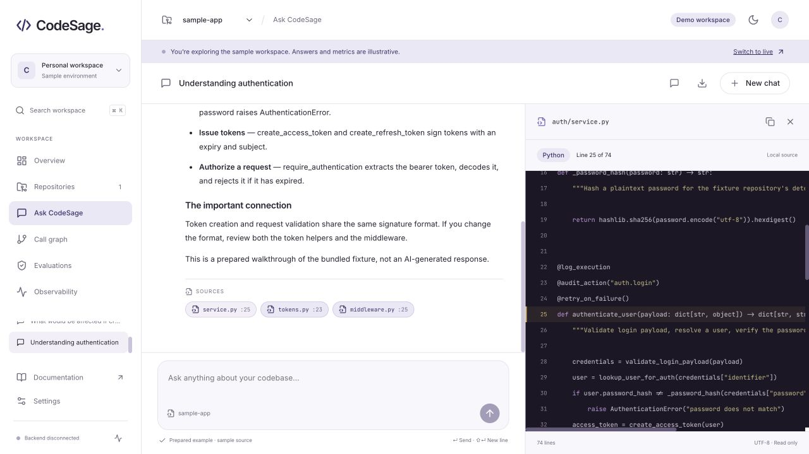
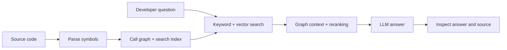

# CodeSage

### Understand a codebase through its code, connections, and context.

CodeSage is a code exploration platform that pairs AI search with a call graph. It is designed to help developers trace behavior, investigate bugs, and understand the impact of a change without reading every file first.

**Built by [Yash Jain](https://github.com/YashJain2410)** · Python / FastAPI · Next.js / TypeScript · Graph-based retrieval

[Try locally](#try-it-in-two-minutes) · [Architecture](docs/ARCHITECTURE.md) · [Engineering decisions](docs/ARCHITECTURE.md#design-tradeoffs) · [Documentation](docs/README.md)



> **Status:** Active development. The interactive frontend demo runs independently. Backend indexing and query components are implemented, with integration gaps documented in [API limitations](docs/API.md#current-limitations). Demo answers and scores are illustrative. A platform walkthrough video will be added here after completion.

## What it helps you answer

| Developer question | CodeSage workflow |
| --- | --- |
| “How does authentication work?” | Ask a question, inspect the answer, and follow source citations. |
| “What calls this function?” | Explore callers, callees, and neighboring symbols in the graph. |
| “What might a refactor affect?” | Use dependency context to investigate related code. |
| “How do we check answer quality?” | Inspect evaluation views; the backend includes metrics and a regression comparison harness. |

The workspace brings together repository inputs, chat, source inspection, graph exploration, evaluation, and telemetry. Live controls reflect backend availability; **Explore the demo** shows the full interface using labeled sample data.

## The engineering behind it

| Decision | Why it matters | Inspect the implementation |
| --- | --- | --- |
| Parse source into symbols and relationships | Preserve function boundaries, source locations, and call context. | [Parser](backend/app/core/parser/) · [Graph builder](backend/app/core/graph/builder.py) |
| Combine keyword and vector search | Match exact identifiers as well as questions phrased in natural language. | [Hybrid retrieval](backend/app/core/retrieval/hybrid.py) |
| Expand through the graph, then rerank | Bring related functions into context and prioritize relevant candidates. | [Graph expansion](backend/app/core/retrieval/graph_expander.py) · [Reranker](backend/app/core/retrieval/reranker.py) |
| Keep the UI behind one API adapter | Handle current and proposed contracts without spreading transport logic across screens. | [API adapter](frontend-next/src/lib/api.ts) |
| Expose quality and runtime signals | Make evaluation and latency observable; separate examples from measured results. | [Evaluation](backend/app/evaluation/) · [Metrics](backend/app/observability/metrics.py) |



Source inspection and citation navigation are implemented in the UI. The current backend returns empty citations and a fixed confidence value; see [API limitations](docs/API.md#current-limitations) before interpreting them as quality signals.

## Try it in two minutes

Requires **Node.js 20.9+**; Node.js 22 is the documented development version.

```bash
git clone https://github.com/YashJain2410/CodeSage.git
cd CodeSage/frontend-next
npm ci
cp .env.example .env.local
npm run dev
```

Open [localhost:3000](http://localhost:3000) and select **Explore the demo**. No API key or backend is needed for the demo. For live services, follow [local setup](docs/GETTING-STARTED.md).

## Repository map

```text
frontend-next/        Current Next.js application and protocol tests
backend/app/core/    Parsing, graphs, indexing, retrieval, and agent workflow
backend/app/api/     HTTP routes and request handling
backend/app/evaluation/  Golden questions, scoring, and regression comparison
backend/tests/       Unit tests, integration tests, and sample codebase
infra/               Local services, Prometheus config, and Grafana dashboard
frontend/            Earlier React/Vite client
notebooks/           Exploration notebooks
docs/                Setup, architecture, API, testing, and operations
```

## Quality and delivery

The frontend has protocol tests for streamed responses, citation parsing, graph formats, and Prometheus summaries. A recorded browser review covers desktop/mobile layouts and demo workflows. See [testing](docs/TESTING.md) and the [frontend verification record](frontend-next/QA.md) for evidence and limits.

Dockerfiles, database migrations, and monitoring configuration are included. Public deployment, multi-user isolation, and a working automated backend quality gate are **not yet established**. No production performance or accuracy benchmark is claimed.

## Read further

- [Architecture](docs/ARCHITECTURE.md): services, data flow, and state ownership.
- [API reference](docs/API.md): mounted routes, requests, and known limitations.
- [Operations](docs/OPERATIONS.md): deployment requirements, recovery, and monitoring.
- [Testing](docs/TESTING.md): checks, evaluation, and verification evidence.

**Project use:** This is a personal portfolio project and is not accepting external contributions. No project license has been selected. Bundled font licenses remain in [the font directory](frontend-next/public/fonts/).
