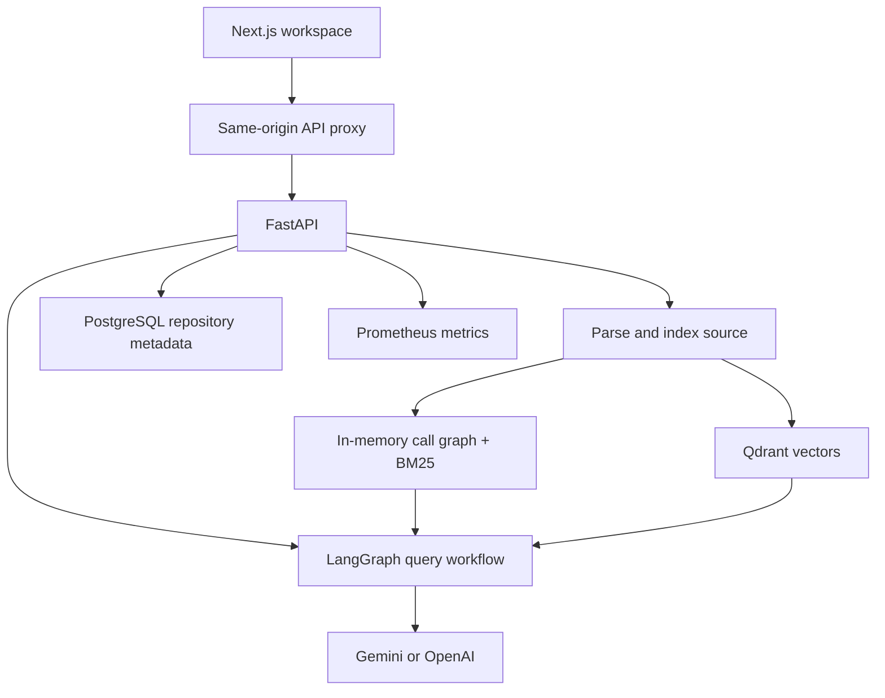
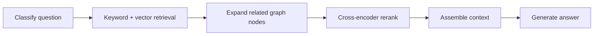

# Architecture

CodeSage has a browser workspace, a Python API, and a retrieval pipeline that uses both text similarity and code relationships.

This diagram shows intended component relationships present in source. [Current limitations](API.md#current-limitations) records the integration mismatches that prevent treating it as a verified end-to-end deployment.

## Indexing

The pipeline discovers `.py`, `.js`, `.ts`, and `.tsx` files, parses symbols, resolves imports, builds a NetworkX graph, and embeds source with caller/callee context. Qdrant stores vectors and source metadata; BM25 holds keyword-search documents.

The Python and JavaScript parsers are selected by the current dispatcher. A separate TypeScript parser exists, but `.ts` and `.tsx` currently go through the JavaScript parser. TypeScript-specific syntax support therefore needs validation.

## Answering a question

Question intents are **explain**, **bug**, **impact**, **test**, and **onboard**. Reciprocal rank fusion combines keyword and vector rankings without comparing incompatible raw scores. Graph expansion uses the intent to select useful relationships.

LangGraph includes a confidence branch with up to two retries. The current generation node always sets confidence to `1.0` and citations to `[]`, so this branch is not yet a meaningful quality control.

## State ownership

| State | Owner | Consequence |
| --- | --- | --- |
| Graph, keyword index, active repository path | API process memory | Restart loses the active context; multiple workers do not share it. |
| Code vectors | Qdrant `codesage` collection | Indexing recreates the collection and replaces previous vectors. |
| Repository records | PostgreSQL | Metadata alone cannot restore the in-memory graph. |
| Uploaded ZIP source | Backend workspace directories | Requires disk cleanup and a data-retention policy. |
| Conversations and repository entries | Browser local storage | Not synchronized to an account. |
| Source previews | Browser memory | Lost on refresh. |

The current runtime is a personal, single-active-repository workspace. A `repository_id` in a query does not select an isolated graph. Celery task modules exist, but the registered ZIP upload indexes synchronously.

## Design tradeoffs

| Choice | Benefit | Cost or limit |
| --- | --- | --- |
| Symbol-based parsing | Preserve function boundaries and source locations. | Dynamic calls cannot always be resolved statically. |
| Keyword + vector search | Match exact names and natural-language questions. | Both indexes must describe the same source version. |
| Graph expansion + reranking | Include related code, then prioritize relevant candidates. | More candidates and another model add latency and memory cost. |
| Explicit workflow stages | Make retrieval and generation easy to inspect. | Quality checks need meaningful evidence and calibrated scores. |
| Same-origin API proxy | Simplify browser integration. | Upload limits, timeouts, and build-time configuration matter. |
| Independent demo mode | Make the product easy to review without credentials. | Sample answers cannot establish backend accuracy. |

No comparative retrieval benchmark is published yet. Use the same golden questions to compare keyword-only, vector-only, hybrid, and graph-expanded retrieval. Record answer quality, retrieved symbols, latency, model versions, and hardware. Static test links do not measure executed test coverage.
