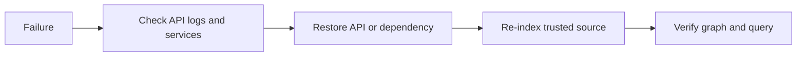

# Operations

CodeSage currently supports a local development workspace. The included Dockerfiles are packaging foundations; this repository does not establish a validated public production deployment.

## Frontend packaging

From `frontend-next/`:

```bash
npm run build
npm start
```

Set `CODESAGE_BACKEND_URL` and `NEXT_PUBLIC_API_MODE=current` before building. Rewrites and public environment values are included in the build output.

```bash
docker build --build-arg CODESAGE_BACKEND_URL=http://backend:8000 -t codesage-frontend-next .
```

The frontend image runs as an unprivileged user. Its backend hostname must resolve on the container network. See the [frontend README](../frontend-next/README.md) for runtime details.

The backend image is built with `docker build -t codesage-backend backend` from the root. Its Dockerfile expects environment variables at runtime. Container startup, remote Qdrant configuration, and end-to-end indexing need validation; localhost defaults cannot reach another container automatically.

## Before public deployment

| Area | Required condition |
| --- | --- |
| Access | Authentication, authorization, repository isolation, and rate limits are enforced. |
| Uploads | Filenames/paths, archive expansion size, file count, and storage limits are validated server-side. |
| Persistence | PostgreSQL, Qdrant, and source storage have persistent volumes and tested backups. |
| Runtime | Graph/index state is restored or scoped outside a single process; indexing cannot erase another user's vectors. |
| Networking | HTTPS is enabled; data services are private; CORS and proxy limits match the deployment. |
| Quality | Backend integration tests and a reproducible evaluation gate pass. |
| Delivery | Real deployment automation, readiness checks, and rollback are verified. |

`infra/docker-compose.yml` has development credentials and no persistent data volumes. `infra/docker-compose.prod.yml` is empty. Recreating local containers can lose data. The GitHub deploy workflow does not deploy anything.

## Credentials and source data

Keep provider keys in backend environment variables; never place them in `NEXT_PUBLIC_*` settings. Retrieved source is sent to the selected model provider, and the intent fallback can send questions to Gemini. Use only source you have permission to process. Uploaded archives and vector payloads retain source data; browser history has a separate lifetime.

Ignore rules keep local secrets and artifacts out of new commits. They do not remove secrets from Git history; rotate any credential that was exposed.

## Monitoring

- `/metrics` exposes query/retrieval/model signals. Inspect the [metric definitions](../backend/app/observability/metrics.py) before setting alerts.
- Prometheus targets `host.docker.internal:8000`; verify host reachability on your platform.
- Grafana's Compose host port is 3000, which conflicts with the frontend. Change that mapping before running both.
- The [Grafana dashboard JSON](../infra/grafana/dashboards/codesage.json) must be imported manually; Compose does not provision it.
- The root endpoint reports an application message. The unmounted health route returns fixed booleans and is not a real readiness probe.

## Recovery



After an API restart, re-indexing is needed to rebuild in-memory context, using the ZIP upload path after validating the pipeline. It replaces the shared Qdrant collection. Preserve any vectors needed for diagnosis before doing so.

Back up database metadata, source directories, vector collections, and the exact application/configuration version together. Keep credentials separate. A metadata backup alone cannot restore query state. No restore drill or rollback procedure has been validated yet.
